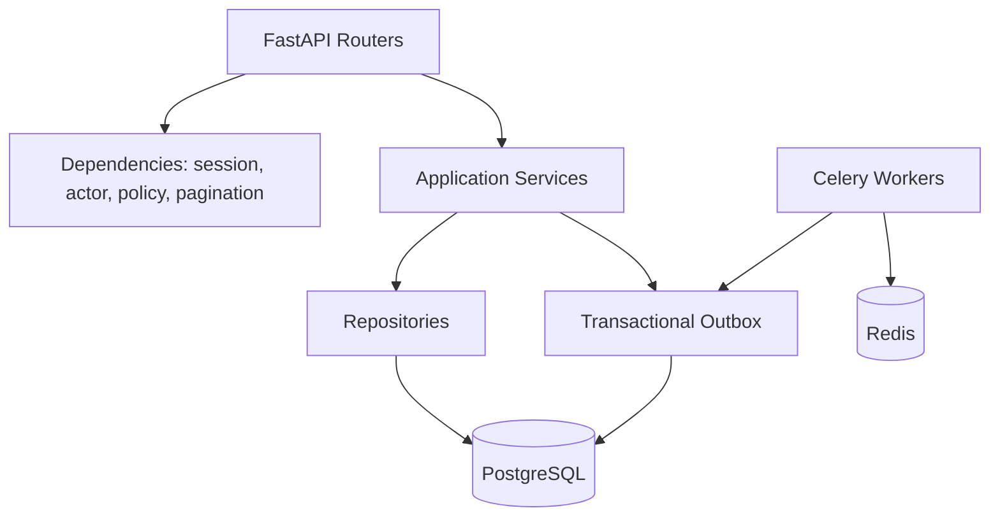

# Backend Architecture Blueprint

## 1. Runtime Shape

The backend is an asynchronous FastAPI application with PostgreSQL persistence,
Redis-backed infrastructure, and Celery workers.



## 2. Request Lifecycle

1. Request ID middleware creates or propagates `X-Request-ID`.
2. Structured logging middleware records method, route, actor, duration, and
   status without leaking secrets.
3. Authentication dependency verifies the access JWT and resolves the active
   user.
4. Authorization dependency evaluates permission, department scope, and
   resource-level policy.
5. Router validates the HTTP contract with Pydantic schemas.
6. Application service executes the use case in a transaction.
7. Repository performs database operations and returns mapped entities.
8. Service writes activity and outbox records in the same transaction.
9. Exception handlers return a stable API error envelope.

Routers do not contain business rules, repositories do not decide access, and
Celery tasks do not bypass application services for business transitions.

## 3. Dependency Injection

FastAPI dependencies provide per-request infrastructure:

```text
AsyncSession
  -> repositories
  -> application services
  -> current actor
  -> authorization policy
```

Composition stays explicit. This makes service tests fast because repositories,
the clock, and event publishers can be substituted without starting FastAPI.

## 4. Data Access

- SQLAlchemy 2.x async sessions use `asyncpg`.
- A transaction is owned by the use case, not by individual repository calls.
- Repositories expose intention-revealing methods such as
  `list_assigned_audits`, `get_for_update`, and `list_overdue_tasks`.
- Queries eagerly load only relationships needed by the response.
- List APIs accept typed filter objects and explicit sort options.
- API schemas are separate from ORM mappings to avoid accidental data leaks.

Generic repositories are limited to small shared mechanics. Domain-specific
queries stay in domain repositories because an overly abstract base repository
usually obscures performance and authorization behavior.

## 5. Error Contract

All errors use a predictable shape:

```json
{
  "error": {
    "code": "AUDIT_INVALID_STATUS_TRANSITION",
    "message": "Audit cannot move from draft to closed.",
    "details": {},
    "trace_id": "a6657d90-4000-4c2e-80b8-8484d8308a1f"
  }
}
```

Exception groups:

| Category | HTTP status | Example |
| --- | --- | --- |
| Validation | `422` | Invalid filter or payload |
| Authentication | `401` | Expired access token |
| Authorization | `403` | Missing permission or department scope |
| Missing resource | `404` | Unknown audit |
| Conflict | `409` | Invalid state transition or stale version |
| Rate limit | `429` | Excessive login attempts |
| Internal | `500` | Unexpected failure with trace ID |

Unexpected exceptions are logged with stack traces and correlation IDs, while
clients receive a sanitized response.

## 6. Authentication And RBAC

### Access token

JWT claims remain deliberately small:

```json
{
  "sub": "user-uuid",
  "sid": "session-uuid",
  "type": "access",
  "iat": 1780416000,
  "exp": 1780416900,
  "jti": "token-uuid"
}
```

Permissions and department membership are resolved server-side and may be
cached briefly in Redis. They are not trusted from long-lived token claims.

### Login flow

1. Validate credentials with a modern password hash.
2. Apply rate limiting by IP and normalized email.
3. Create an authentication session.
4. Return a short-lived JWT access token and an opaque rotating refresh token.
5. Store only the refresh token hash.
6. On refresh, consume the current token and issue its replacement atomically.
7. On reuse detection, revoke the token family and session.

### Policy evaluation

Policies combine:

- permission code;
- actor roles;
- department scope;
- entity ownership;
- workflow assignment;
- entity lifecycle state.

The same policy service is called by HTTP dependencies and business services.

## 7. Caching

Redis uses cache-aside reads with namespaced keys:

```text
authz:user:<user_id>:v<policy_version>
dashboard:summary:<department_scope_hash>:<period>
directory:department:<department_id>:page:<cursor_hash>
```

- Authorization caches use short TTLs and explicit invalidation on role or
  membership changes.
- Dashboard caches tolerate brief staleness and are invalidated by domain
  events.
- Transactional records such as workflow task approval are never authorized
  solely from a cached entity snapshot.

## 8. Background Processing

Celery queues keep latency-sensitive work separate:

| Queue | Tasks |
| --- | --- |
| `default` | Outbox dispatch and lightweight integration tasks |
| `notifications` | Email, in-app notification, WebSocket publication |
| `workflow` | SLA scans, escalation, scheduled transitions |
| `analytics` | Projection and materialized-view refresh |
| `files` | Malware-scan integration and metadata processing |

Tasks are idempotent. Retries use exponential backoff with jitter and bounded
attempts. Repeated failures are visible in logs and operational metrics.

## 9. Realtime Notifications

1. A business use case commits a domain event to `outbox_events`.
2. The outbox worker converts the event into a persisted notification.
3. The worker publishes a compact notification payload through Redis.
4. WebSocket workers subscribed to the channel push to connected user sockets.
5. The SPA reconciles the push event with the persisted notification API.

WebSocket delivery is an acceleration path, not the source of truth.

## 10. Observability

The backend emits JSON logs with:

- timestamp, severity, service, environment;
- request ID and correlation ID;
- actor ID when known;
- route, status code, and duration;
- task name, retry count, and event ID for background jobs.

Production hardening will add metrics for request latency, error rate, database
pool pressure, queue depth, task failures, WebSocket connections, SLA breach
counts, and outbox backlog.

## 11. Testing Layers

| Layer | Focus |
| --- | --- |
| Unit | Domain transitions, policies, risk calculation, filter validation |
| Service | Use cases with repository substitutes and event assertions |
| Repository integration | PostgreSQL queries, constraints, indexes, soft delete behavior |
| API | Auth, validation, policy enforcement, pagination, error shape |
| Worker integration | Idempotency, retry behavior, outbox delivery |

Tests use PostgreSQL rather than SQLite because PostgreSQL-specific behavior
such as JSONB, partial indexes, and row locking is part of the design.

## 12. Phase 2 Implementation Order

Phase 2 should be implemented in these small, verifiable slices:

1. Backend package, tooling, settings, structured logging, health endpoint.
2. Docker Compose services for PostgreSQL and Redis.
3. Async SQLAlchemy base, session dependency, Alembic configuration.
4. Identity and organization models with initial migration.
5. Deterministic role, permission, department, and demo-user seed script.
6. Password hashing, login, access JWT, refresh rotation, logout.
7. RBAC policy service and protected reference endpoints.
8. Backend service and API tests for the authentication boundary.

Audit and workflow business features begin only after this foundation passes
tests.
