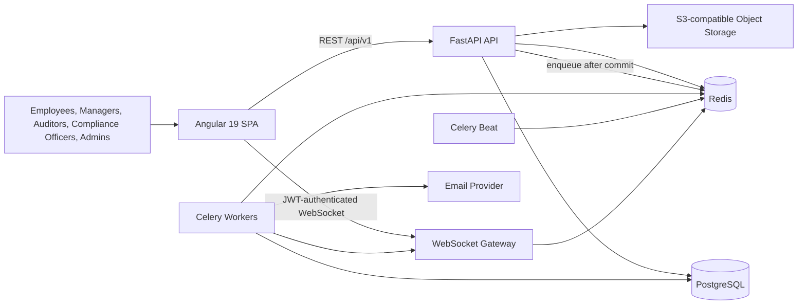
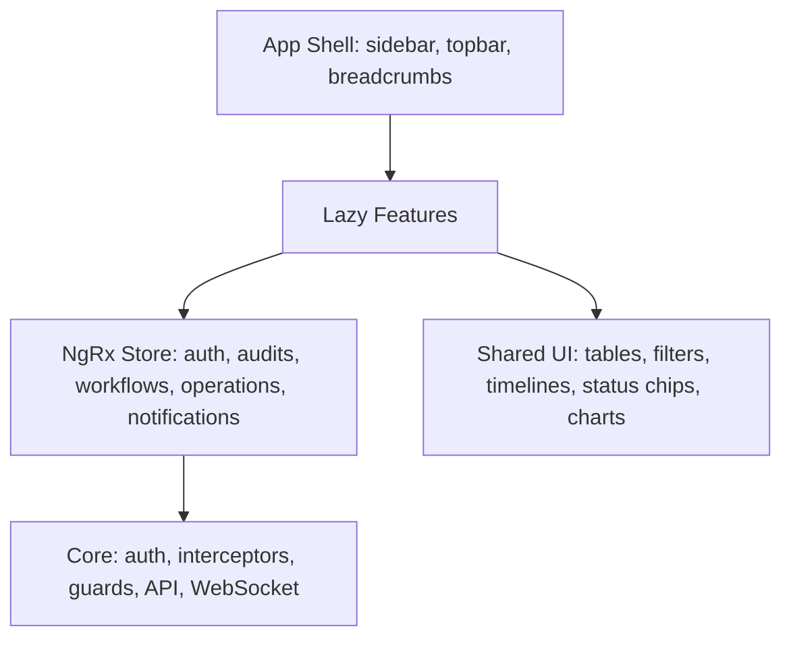

# System Architecture

## 1. Product Scope

The Enterprise Operations & Audit Automation Platform is a multi-department
internal operations system. It manages controlled business processes rather
than acting as a generic CRUD application.

Core capabilities:

- secure workforce identity and department-aware access;
- audit planning, findings, controls, evidence, and lifecycle tracking;
- reusable workflow definitions and auditable approval execution;
- leave, expense, travel, and internal task operations;
- KPI dashboards and operational reporting;
- real-time notifications and activity feeds.

## 2. Architectural Style

The initial backend is a **modular monolith** with asynchronous workers.
Modules run in one FastAPI deployable but own their API routes, application
services, repositories, schemas, models, and events. This is intentional:

- transactional workflows remain straightforward;
- local development and deployment stay manageable;
- domain boundaries are visible in code;
- selected modules can be extracted later if scale justifies the operational
  cost.

Cross-module interaction follows two rules:

1. Synchronous calls use a module's application service interface.
2. Asynchronous side effects use domain events written to a transactional
   outbox and dispatched by Celery.

No module reaches into another module's repository.

## 3. System Context

Object storage is an integration boundary. A local S3-compatible service may
be enabled in development; production should use the organization's managed
object store. Binary attachments do not belong in PostgreSQL.

## 4. Backend Bounded Contexts

| Module | Responsibilities | Important boundaries |
| --- | --- | --- |
| Identity | Login, refresh rotation, sessions, users, roles, permissions | Central policy source; never embeds business workflows |
| Organization | Departments, memberships, reporting relationships | Supplies department scope to policy checks |
| Audit | Audits, controls, findings, evidence, risk scoring, lifecycle | Uses workflow instances for approvals |
| Workflow | Versioned definitions, steps, instances, approvals, SLA, escalation | Generic engine; does not hard-code audit or HR rules |
| Operations | Leave, expense, travel, tasks | Uses workflow instances for approval routing |
| Notification | Notifications, mentions, preferences, WebSocket fan-out | Consumes events; does not own business state |
| Analytics | KPI reads, dashboard projections, bottleneck and risk aggregates | Read-oriented; refreshed asynchronously |
| Platform | Outbox, immutable activity records, file metadata | Shared infrastructure with narrow interfaces |

## 5. Frontend Architecture

The Angular SPA is feature-based and lazy-loaded. NgRx stores durable
cross-route state such as identity, filters, entity collections, and
notifications. Angular Signals model view-local derived state and lightweight
component coordination. RxJS remains the API and event-stream composition
layer.

## 6. Security Model

Authorization is enforced in the backend. Role-aware frontend rendering is a
usability feature, never a security boundary.

- Access tokens are short-lived JWTs.
- Refresh tokens are opaque random values, stored as hashes, rotated on use,
  and revoked as a token family when reuse is detected.
- Sessions record device metadata, last activity, expiry, and revocation.
- RBAC grants permissions to roles.
- Department scope constrains business data: `own`, `department`,
  `department_tree`, or `all`.
- Resource-level checks protect assignments and workflow tasks.
- Immutable activity logs record security-sensitive and business-critical
  transitions.

Initial roles:

| Role | Typical access |
| --- | --- |
| Admin | Platform configuration and organization-wide administration |
| Auditor | Assigned audits, evidence, findings, and audit comments |
| Manager | Department operations, approvals, and operational KPIs |
| Employee | Own requests, own tasks, and permitted directory views |
| Compliance Officer | Audit oversight, controls, risk, and compliance KPIs |

## 7. Reliability And Scale

- PostgreSQL is the transactional source of truth.
- Redis supports cache-aside reads, Celery brokering, rate limits, and
  WebSocket fan-out.
- Celery handles notifications, SLA checks, escalations, analytics refreshes,
  attachment post-processing, and outbox delivery.
- API list endpoints use bounded pagination, filters, stable sorting, and
  indexed predicates.
- The outbox pattern prevents lost asynchronous side effects after database
  commits.
- Analytics queries use projections and materialized views where appropriate,
  not expensive joins on every dashboard refresh.
- All services emit structured logs with request and correlation IDs.

## 8. API Conventions

- Base path: `/api/v1`
- Resource names: plural nouns, such as `/audits` and `/workflow-instances`
- Identifiers: UUIDs
- Time: UTC ISO 8601 at API boundaries; user timezone only for presentation
- Errors: stable machine-readable codes with trace IDs
- Pagination: cursor pagination for activity feeds; page/size pagination for
  administrative tables
- Concurrency: optimistic version columns for frequently edited aggregates
- Idempotency: required for retry-sensitive mutation endpoints

## 9. Extraction Path

The modular monolith is not a dead end. If usage data warrants extraction:

1. Move notification fan-out behind its existing event consumer boundary.
2. Move analytics projection workers and read APIs independently.
3. Split workflow execution only after measuring database and worker load.

Identity and the transactional business modules should remain together until
there is a concrete scaling or ownership reason to separate them.
