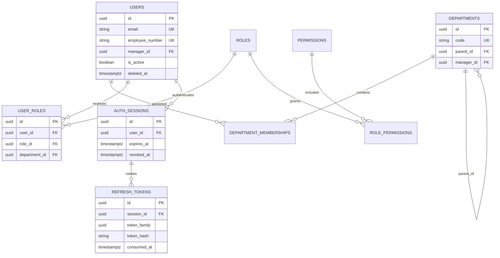
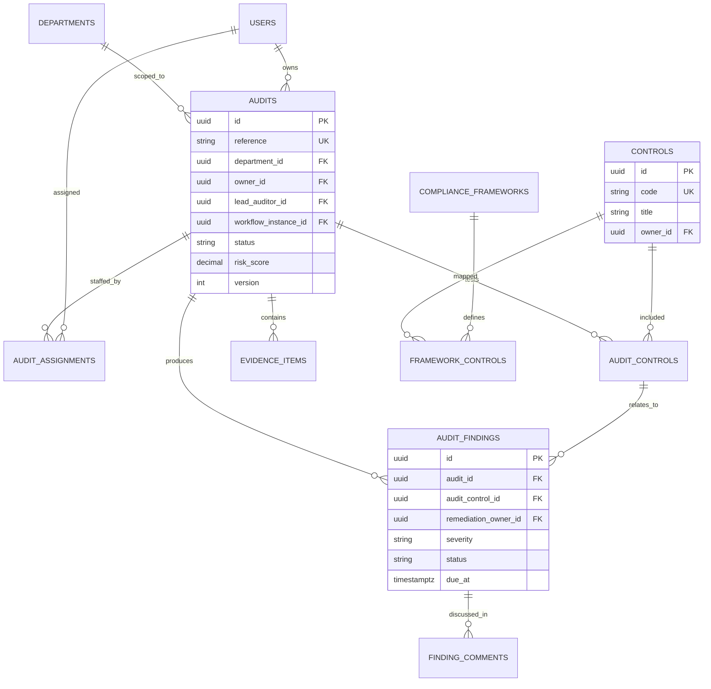
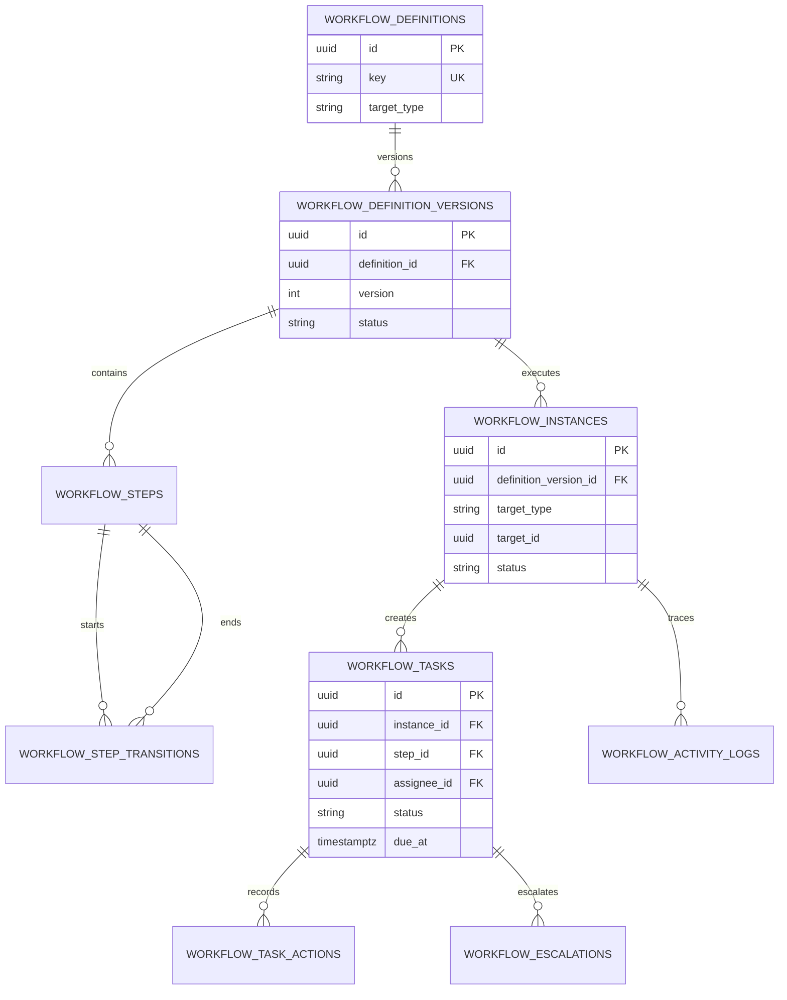
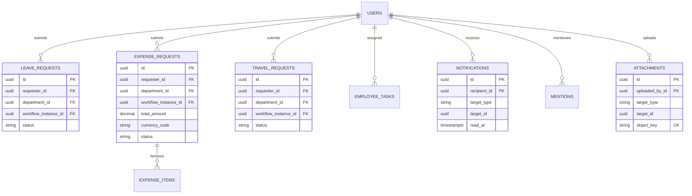

# ER Diagram

The diagram is intentionally split by domain so it remains readable during
implementation and review.

## Identity And Organization

## Audit And Compliance

## Workflow Engine

## Operations And Collaboration

## Polymorphic References

`workflow_instances`, `notifications`, `mentions`, `attachments`, and
`activity_logs` use a controlled `target_type` plus `target_id` pair. A normal
foreign key cannot enforce these polymorphic relationships. Application
services validate target existence and authorization, and integration tests
cover each supported target type.
